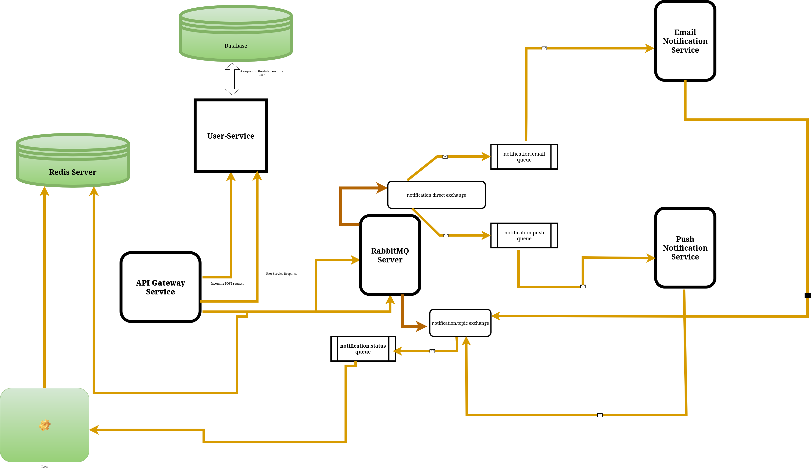

# Notification API Gateway

This project implements a high-performance, asynchronous API Gateway designed to handle and route all system notifications (Email, Push, SMS, etc.). It acts as a resilient buffer between client services and slow delivery mechanisms, ensuring fast response times and reliable status tracking.

## Key Features

  * **Fast & Asynchronous:** Built with **FastAPI** to maximize concurrent request handling.
  * **Decoupled Architecture:** Uses **RabbitMQ** as a message broker to separate the request (API call) from the slow task (sending email/push).
  * **Priority Queuing:** Leverages RabbitMQ's **Priority Queue** feature to ensure critical notifications (e.g., password resets) are processed before standard messages.
  * **Real-time Status Tracking:** Uses **Redis** as a fast, centralized store to track notification status from $\text{QUEUED}$ to $\text{DELIVERED/FAILED}$.

-----

## Architecture & Data Flow

The system employs a dual-role, fail-fast strategy where the API Gateway acts as both a **Producer** (sending commands) and a **Consumer** (receiving reports).

### 1\. The Producer (Forward Flow)

1.  **Client POST:** The Gateway receives a request to `/api/v1/notifications/`.
2.  **Enrichment:** It generates a unique `notification_id` and performs necessary data lookups.
3.  **Tracking Setup:** The initial status ($\text{QUEUED}$) is immediately stored in **Redis**.
4.  **Publishing:** The full payload (including the `notification_id` and $\text{priority}$) is published to the RabbitMQ **Direct Exchange** using the channel type (e.g., `routing_key="email"`).

### 2\. The Consumer (Reverse Flow)

1.  **Downstream Report:** The Email Service, after attempting delivery, publishes a status update (e.g., $\text{DELIVERED}$) back to the message broker.
2.  **Gateway Consumer:** A dedicated consumer process within the Gateway ingests this status update.
3.  **Redis Update:** The Gateway uses the **`notification_id`** from the report to update the corresponding record in **Redis**, providing the final status to be queried by external services.

-----

## Local Setup and Installation

### 1\. Prerequisites

You must have the following services running locally:

  * **Python 3.10+**
  * **Docker** (Recommended for RabbitMQ and Redis)
  * **RabbitMQ** instance running on `localhost:5672` (default).
  * **Redis** instance running on `localhost:6379` (default).

### 2\. Dependency Management (using `uv`)

This project uses `uv` for ultra-fast dependency management and virtual environment creation.

```bash
# Ensure uv is installed
pip install uv

# 1. Create and activate the virtual environment
uv venv
source .venv/bin/activate

# 2. Install production dependencies
uv sync

# 3. (Optional) Install development dependencies for testing
uv sync --dev
```

### 3\. Running the Service

The application is run using the Uvicorn server:

```bash
uvicorn main:app --reload
```

-----

## API Endpoints

| Method | Endpoint | Description | Status Code on Success |
| :--- | :--- | :--- | :--- |
| $\text{POST}$ | `/api/v1/notifications/` | Ingests a new notification request and queues it for asynchronous processing. | $\text{202 Accepted}$ |
| $\text{GET}$ | `/health` | Returns the application health status. | $\text{200 OK}$ |
| $\text{GET}$ | `/api/v1/notifications/{id}` | **(To be implemented)** Retrieves the current status (from Redis) of a specific notification. | $\text{200 OK}$ |


### System Design: Decoupled Notification Flow

